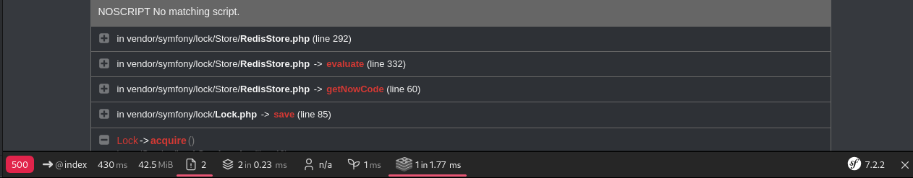
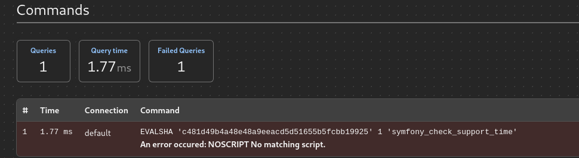
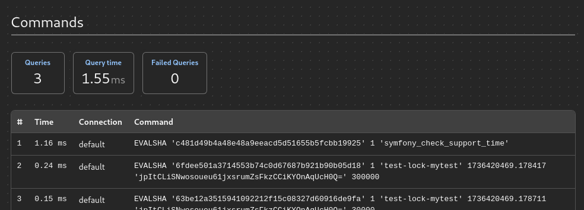
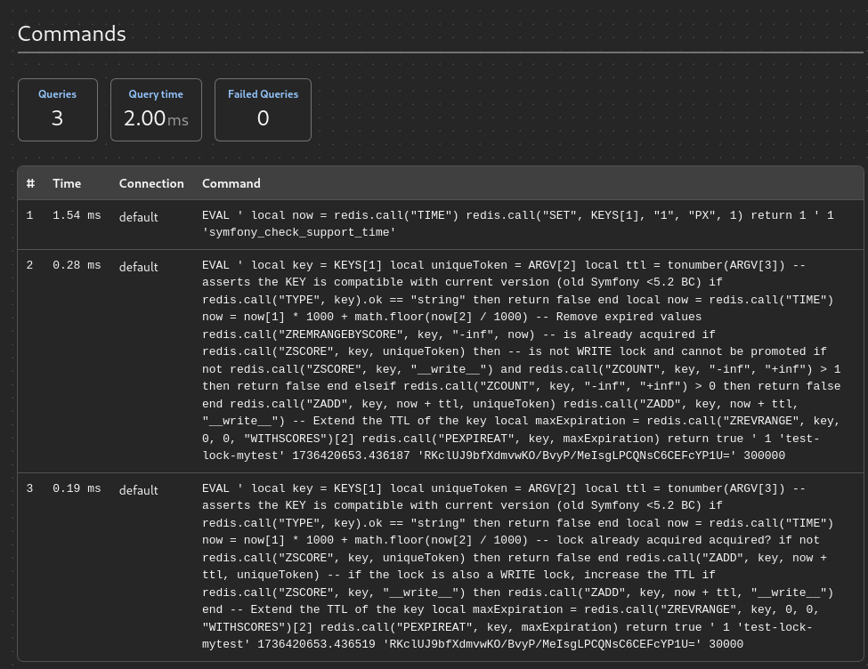

# Symfony 7 and Valkey issues

`symfony/lock` works perfectly fine with Redis and Valkey up to version 6.4.
After that instead of using `eval`, it uses `evalSha`.

For Redis it's still fine, but not for Valkey.

## How to run it

Make sure you have `git`, `docker` and `docker compose` installed and up to date.
Please also have `8080` port free or just change it in your copies of `docker-compose-redis.yml` and `docker-compose-valkey.yml`.
Then it should work like:

```shell
git clone git@github.com:PatNowak/symfony-valkey-poc.git
cd symfony-valkey-poc

# to run valkey (by default we should have here symfony/lock 7.2)
./app.sh valkey
```

You can see then that the website is crashing with 500 error.
If you click on the `Queries` button on it, you'll find Redis / Valkey queries:


Most likely it will be related with any `evalSha` statement:


You can compare it with Redis - it will work.
In order to do that, please do:

```shell
./app.sh down
./app.sh redis
```

The result for Redis (here we have version 8, but I tested also 6+ and 7+) is following:


Consider then to downgrade the `symfony/lock` to `6.4` - last version that used `eval`.

Please do:

```shell
./app.sh 6.4
./app.sh down
./app.sh valkey
```

Then you should see `Hello world!` and if you check Symfony dev toolbar, you'll find `eval` queries:



**Note** Here we use `predis`, but we also tested on our production app that `phpredis` has exactly same issue.
